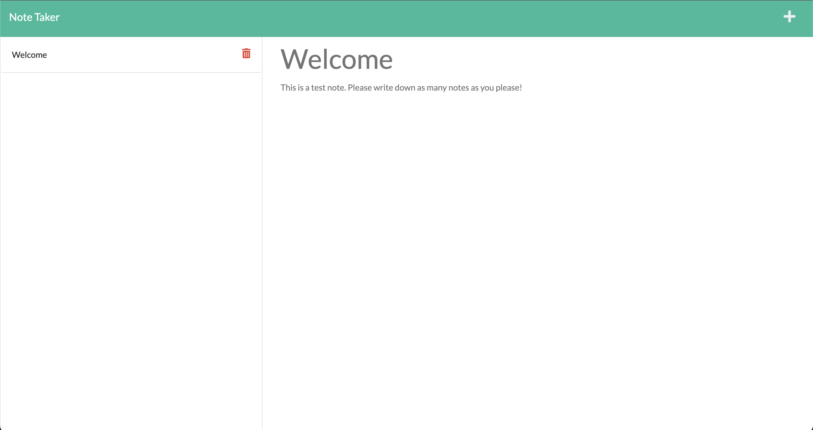

# Take a Note

[](http://unlicense.org/)

## Description

This app was built for users that need to take a quick note on the fly. Once you have written your note you can hit the save button which will keep that note on the screen even if you refresh or leave the page.

## Table of Contents

- [Installation](#installation)
- [Usage](#usage)
- [Contributing](#contributing)
- [Questions](#questions)

### Installation

To install necessary dependencies, run the following command

```md
    npm init -y
    npm i
```

### Usage

To start the app localy run the following command:

```md
    npm run start
```

### Contributing

If you would like to contribute to this app please fork the repo and submit a pull request.

### Questions

If you have any questions please reach out via Github, my username is jessemarino.



URL to page: https://limitless-sea-73688.herokuapp.com/
